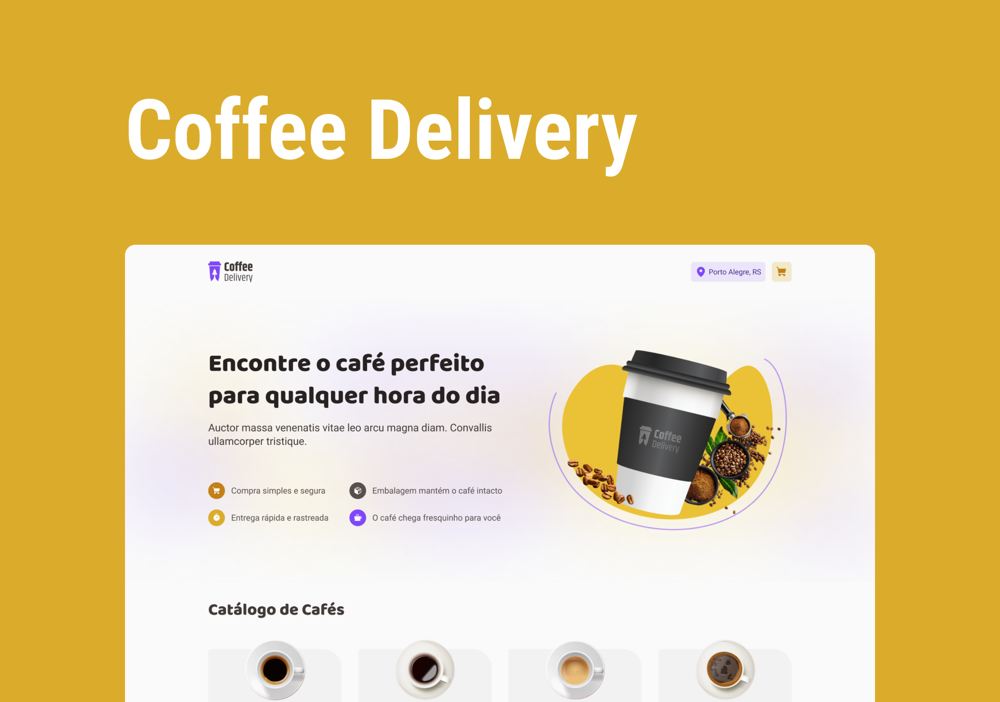

# Coffe Delivery



<br />

## About the project

Ecommerce of cafes with delivery option.

---

## :rocket: Technologies

This project was developed with the following technologies:

- Web

  - [x] [NextJS](https://nextjs.org/)
  - [x] [Tailwindcss](https://tailwindcss.com)
  - [x] [React Hook Form](https://react-hook-form.com/)
  - [x] [Lucide](https://lucide.dev/)
  - [x] [Zod](https://zod.dev/)

## :gear: Execute

First clone this repository:

```bash
$ git clone https://github.com/Gustavohsdp/coffe-delivery
$ cd coffe-delivery
```

### Web

```bash
$ npm i
$ npm run dev
```

---

<p align="center">Made with 💜 by Gustavo Henrique</p>
